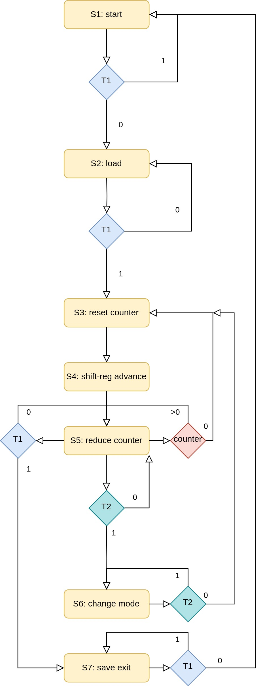

# fpga

FPGA programs created for the KIT: Electronics for Physicists module.

All VHDL code was tested on an ALERTA DE1 board. 

---

- **7-segment:** display 8-bit numbers in HEX.

- **shift-register:** 8-Bit with parallel load and serial in-/output.

- **adder:** a ripple adder.

- **frequency-diver:** 50MHz -> 100Hz.

- **running-light:** looping shift-register with different modes. (up, down; 2Hz, 4Hz)

- **reactiontest:** a state machine for a game to test reaction speeds.

---

### State diagram of the Running Light.

